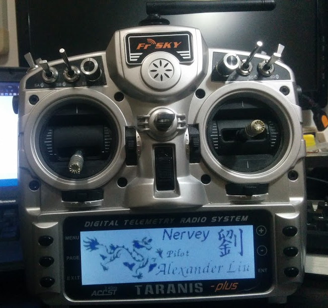
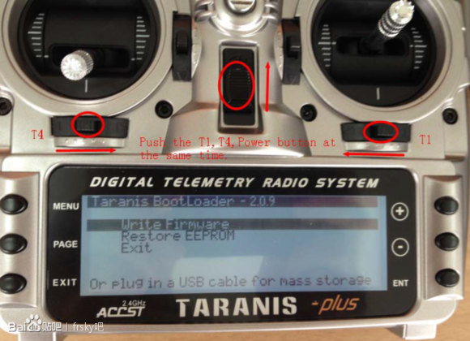
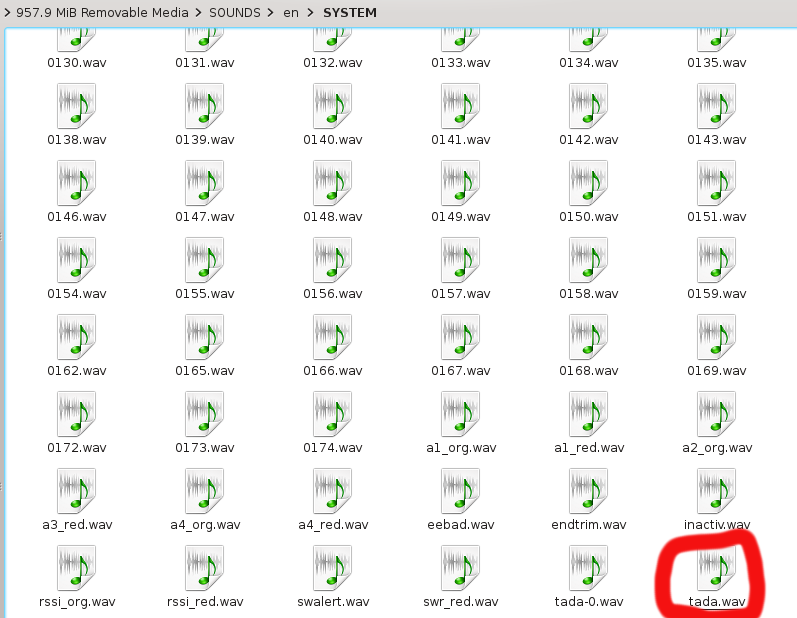
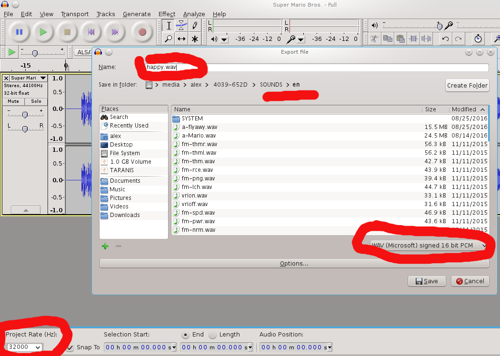

OpenTX Settings
===============

[Alexander Liu](https://github.com/xros)

[OpenTX](http://www.open-tx.org) is an opensource radio control system.

It provides radio transmitter firmware, and radio transmitter PC software for simulation.

Here I added some templates for OpenTX settings.

My radio is a Fr-sky Taranis X9D Plus. Until now it has been flashed with firmware OpenTX 2.1.8 . 

I added splash templates. 

#### Radio when booting up

The welcome splash image

Every one can modify this image **`mylogoxcf_20160809.xcf`** using the opensource image editor [gimp](http://www.gimp.org).

Getting into bootloader
-----------------------

Use taranis as a USB storage drive and save the firmware and settings on it.

Attention: name of firmware can't not be too long. I used "opentx-en-2.1.8.bin" to replace its original name "opentx-taranisplus-timer3-lua-mixersmon-internalppm-en-2.1.8.bin".

Then restart and get into bootloader interface again. 

Change welcome image
-----------------------

After getting into the bootloader, try to connect your radio to computer. It will be recognized as a USB disk.

Then use Companion to load the image to your radio along with the firmware. Info from [here](http://www.open-tx.org/screens-taranis.html)

Personalize poweron voice
-----------------------

On the SD card, go to find file in `SOUNDS/en/SYSTEM/tada.wav` and replace it with yours. 

Here I put a voice sample here in this repo .

#### How to make yours?

- Use audacity
- Download your voice ( It could be a MP3 file or use TTS voice. Someone reads something and records it into wav files )
- Open voice file in audacity
- Change project rate to be 32000 Hz
- Export it in `WAV/(Microsoft) signed 16 bit PCM`
- Save it on SD card (Make sure file name less than 6 chars)

Flash firmware
--------------

In bootloader interface,

Choose "Write Firmware".

Optionally choose "Restore EEPROM". ( I added an EEPROM in `eeprom/*.bin` supported the opensource APM Flight Controller and simulator for Phoenix 5.0 +)

Or we can do all these things in PC software [Companion](http://www.open-tx.org/downloads). Companion can change the splash image very easily.

Flash bootloader
----------------

Firmware ships with bootloader by default.

Here's an older version stable bootloader `213.bin`. If you want to flash the latest bootloader, you can flash bootloader from the firmware in OpenTX radio system.

Copy `bootloader/213.bin` to SD card. Hold key **MENU** to get into Setup Menu then change tap **PAGE** to navigate into File Manager on Taranis. Select the file `213.bin` then flash bootloader.
